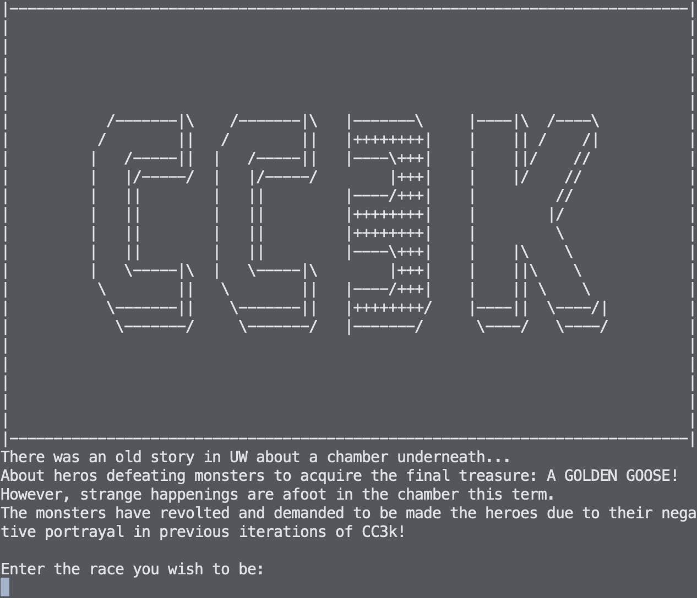
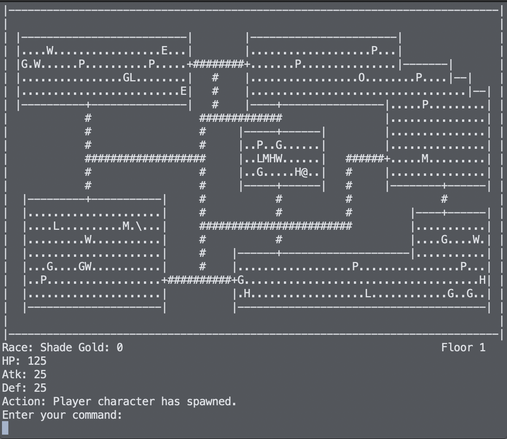

# ChamberCrawler3000 
 CS246 final project

## Introduction
This is an implementation of the game ChamberCrawler3000 for the final project of CS246 Fall 2020.

## Preview

## Content
Final UML:

## Compile
To compile, use the provided Makefile in the Code directory:
`
make
`

## Releases
Executable:
`
cc3k
`

## Note
