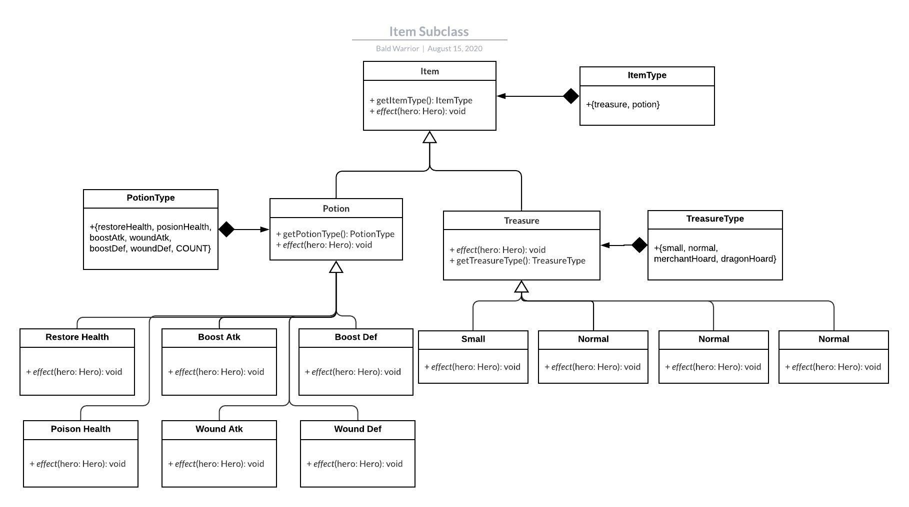
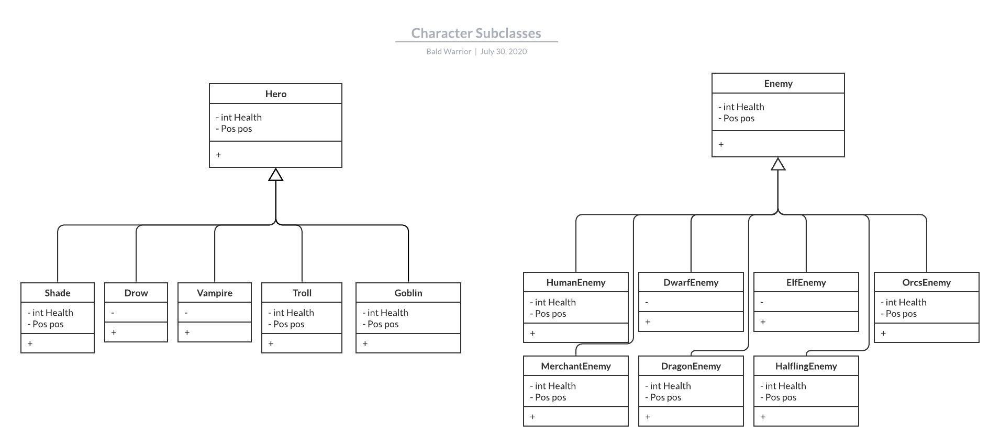

# Bald-Warrior 
 CS246 final project
 
 ## Current Bugs
 1. Enemies does not deal damage.
 1. Potion does not disappear after use.
 1. Potion can be walked on.
 1. Hero does not attack(does not deal damage, does not show in action, action does not refresh after each attack)
 1. Every hoard is written as a dragon hoard in action(Action alwasy display "picks up a dragon hoard" despite type of the treasure).
 1. Dragon hoard increase hero gold only by 1
 1. Dragon is spawned, but not showed on text display
 1. Dragon hoard cannot be walked on before dragon is killed(should be able to walk on but not be able to pick up)
 1. Action shows potion used is Boost Defence, but atk decreased by 5
 1. Drow does not have 1.5 boost on potion
 1. Seg Fault when use potion on the south

## Introduction
This is an implementation of the game ChamberCrawler3000 for the final project of CS246 Fall 2020.

## Plan-of-Attack
The plan of attack is currently under the Google doc: https://docs.google.com/document/d/1_OjW9sLRQMAcANL5a7lCWj5IUhWTBeMBsWmY4eQoMBU/edit?usp=sharing

## Content

See UML here:  
 UML Class: https://app.lucidchart.com/invitations/accept/8a72bed1-27da-45e9-87af-a5d202003426  
 Item Subclasses: https://app.lucidchart.com/invitations/accept/5fc7bb9c-f087-428a-82a2-1bdc291c1951  
 Character Subclasses: https://app.lucidchart.com/invitations/accept/535c1a6a-2fb4-4446-84d0-48ab820d4134  

## Run
To run the program, execute the command in the repository:
`
make
`

## Releases
No releases available

## Note
