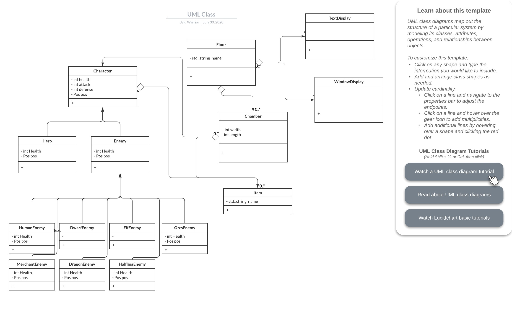

# Bald-Warrior
 CS246 final project

## Introduction
This is an implementation of the game ChamberCrawler3000 for the final project of CS246 Fall 2020.

## Content

See UML here https://app.lucidchart.com/invitations/accept/8a72bed1-27da-45e9-87af-a5d202003426

## Run
To run the program, execute the command in the repository:
    eee

## Releases
No releases available

## Note
