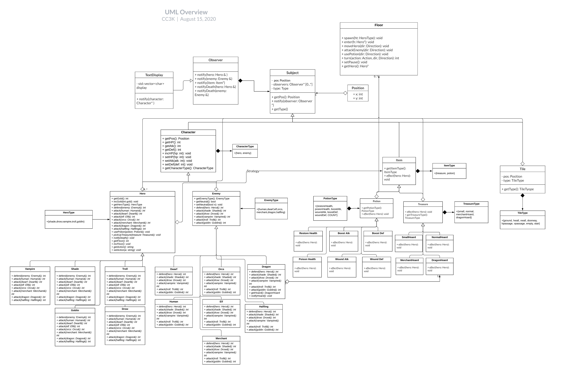
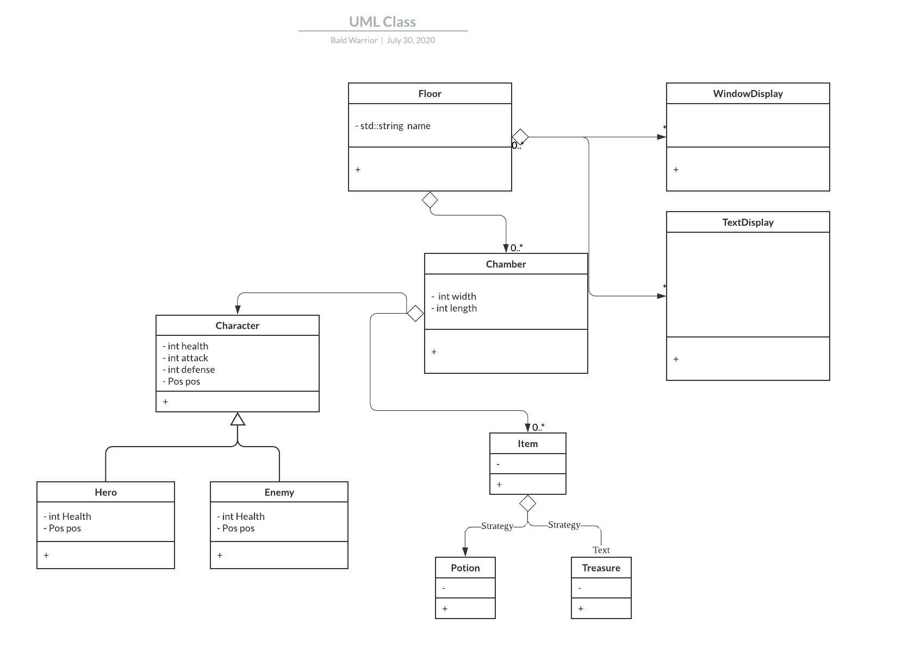
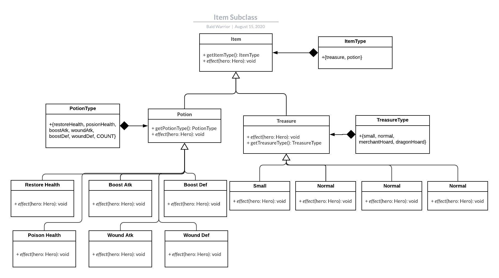
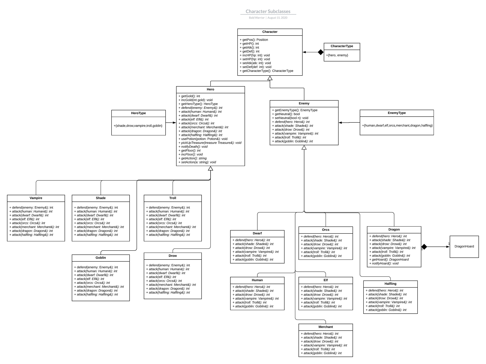

# Bald-Warrior 
 CS246 final project

## Introduction
This is an implementation of the game ChamberCrawler3000 for the final project of CS246 Fall 2020.

## Preview

## Plan-of-Attack
The plan of attack is currently under the Google doc: https://docs.google.com/document/d/1_OjW9sLRQMAcANL5a7lCWj5IUhWTBeMBsWmY4eQoMBU/edit?usp=sharing

## Final-Design
The final design is this Google doc: https://docs.google.com/document/d/1J55c6f5wKjdYrUYM5a5vlprirW6oWPkLcdp_OPZXsSo/edit?usp=sharing

## Content

See UMLs here:  
 Final UML: https://app.lucidchart.com/invitations/accept/bd262368-931c-44dd-a48c-8a16fa8fda47

 UML Class: https://app.lucidchart.com/invitations/accept/8a72bed1-27da-45e9-87af-a5d202003426  
 Item Subclasses: https://app.lucidchart.com/invitations/accept/5fc7bb9c-f087-428a-82a2-1bdc291c1951  
 Character Subclasses: https://app.lucidchart.com/invitations/accept/535c1a6a-2fb4-4446-84d0-48ab820d4134  

## Run
To compile, use the provided Makefile in the Code directory:
`
make
`

## Releases
Executable:
`
cc3k
`

## Note
